<h1 align="center">OpenCode Enterprise</h1>

<p align="center">
  低成本的企业级智能生态驱动器<br/>
  基于 <a href="https://github.com/anomalyco/opencode">OpenCode</a> 的 CLI Agent + MCP 编排能力构建
</p>

<p align="center">
  
  
  
  
  
  
</p>

> **声明**：本项目基于 [OpenCode](https://github.com/anomalyco/opencode) 二次开发，非 OpenCode 官方团队出品，与其无隶属关系。

---

## 为什么做这个项目

OpenCode 是一个被低估的开源项目。大多数人把它当作"又一个 AI 编程工具"，但我们看到的是：

| 能力 | 价值 |
|------|------|
| **CLI Agent 架构** | 不依赖 IDE 插件，任何终端环境都能跑，部署灵活 |
| **MCP 协议原生支持** | 标准化的工具调用协议，一次接入、处处可用 |
| **极低的 Token 消耗** | 精简的 prompt 工程 + 高效的上下文管理，同等任务比同类产品省 60%+ tokens |
| **SessionHook 扩展点** | 6 个细粒度 Hook，零侵入注入企业逻辑 |

把这些能力组合起来，再加上企业级的管控层（配额、审计、权限），就得到一个**极低成本运行的企业智能生态驱动器**：

- 不是 AI 中台 —— 没有那么重，不做模型训练、不做数据标注
- 不是编程平台 —— AI 只是引擎，MCP 工具才是核心交付物
- 是什么 —— **用最低的 Token 成本，通过 MCP 协议把 AI 能力接入企业的任何业务系统**

```
你的 CRM 系统 ←── MCP ──┐
你的运维平台 ←── MCP ──┤
你的数据仓库 ←── MCP ──┼── OpenCode Agent ←── 自然语言指令
你的文档系统 ←── MCP ──┤
你的内部 API ←── MCP ──┘
```

一个人对着对话框说一句话，AI Agent 通过 MCP 自动调用正确的工具，完成跨系统的业务操作。成本？可能就几分钱的 Token。

---

## 目录

- [功能演示](#功能演示)
- [系统架构](#系统架构)
- [核心设计](#核心设计)
  - [为什么选 OpenCode 做引擎](#为什么选-opencode-做引擎)
  - [MCP 生态治理](#mcp-生态治理)
  - [成本控制体系](#成本控制体系)
  - [SessionHook 扩展机制](#sessionhook-扩展机制)
  - [实时通信架构](#实时通信架构)
- [技术栈](#技术栈)
- [快速开始](#快速开始)
- [项目结构](#项目结构)
- [API 概览](#api-概览)
- [License](#license)

---

## 功能演示

### AI 对话 — 自然语言驱动 MCP 工具

<p align="center">
  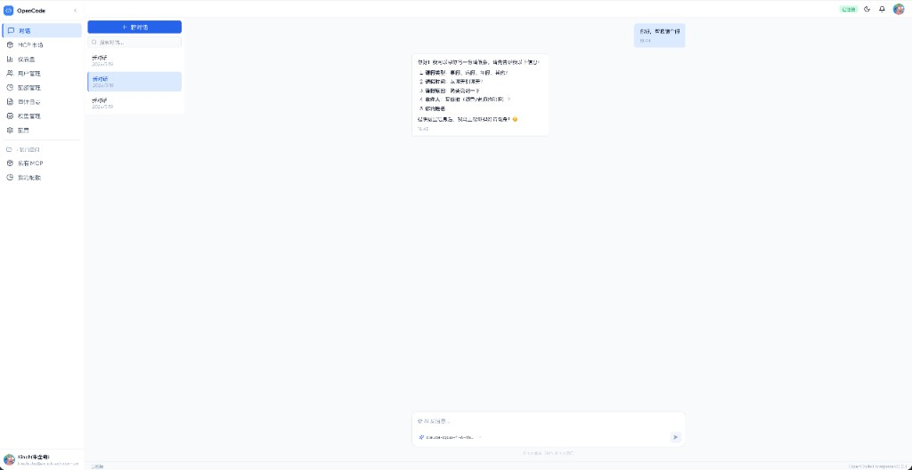
</p>

- 多会话管理，流式输出
- 模型按需切换（默认 + 自定义分组）
- AI 自动识别意图并通过 MCP 调用对应工具

### 模型管理 — 集中管控，用户无感

<p align="center">
  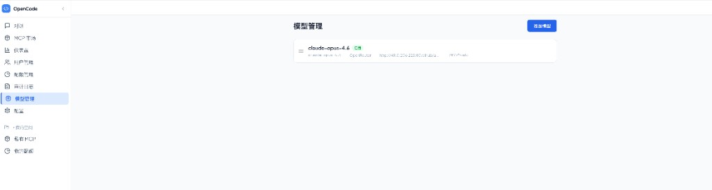
</p>

- 管理员统一配置 API Key 和模型端点
- 支持 OpenAI / OpenRouter / Azure / 自定义兼容协议
- 拖拽排序，一键启停

### 审计日志 — 全链路可追溯

<p align="center">
  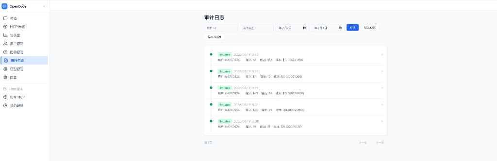
</p>

- 每次对话：谁、用了什么模型、调了哪些工具、花了多少 Token、成本多少
- 按用户 / 操作 / 时间筛选，支持 CSV 导出

### 仪表盘 — 企业用量全景

<p align="center">
  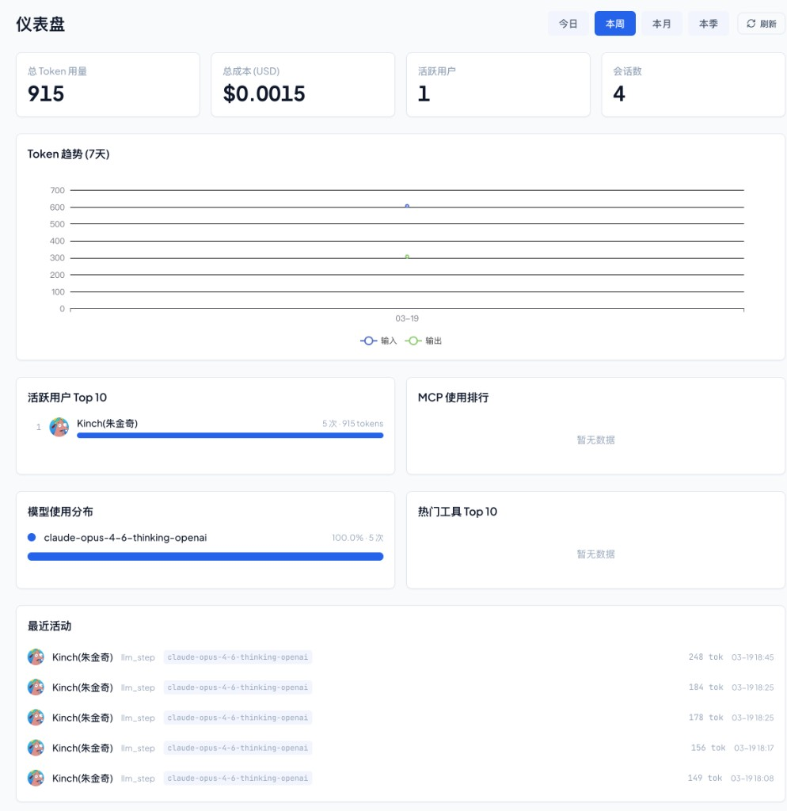
</p>

- KPI 概览、Token 趋势、活跃用户 Top 10、MCP 使用排行、模型分布

---

## 系统架构

### 整体分层

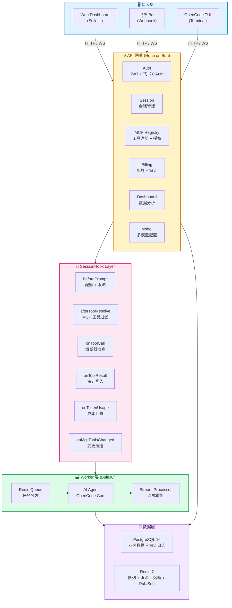

### 请求生命周期

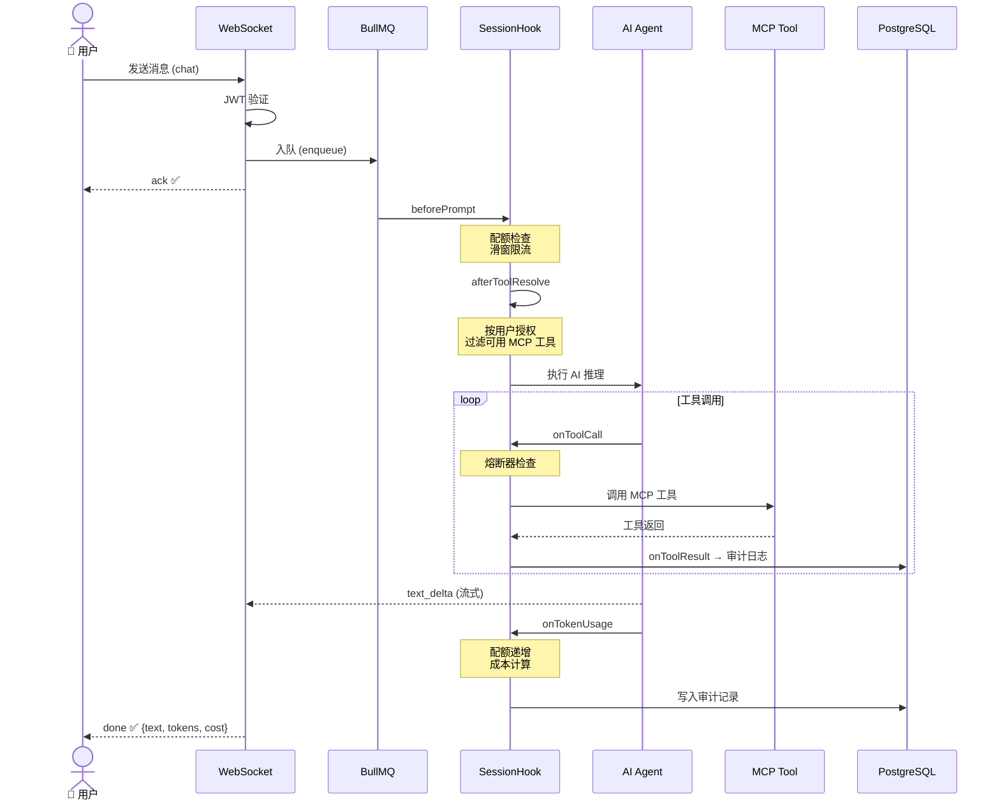

---

## 核心设计

### 为什么选 OpenCode 做引擎

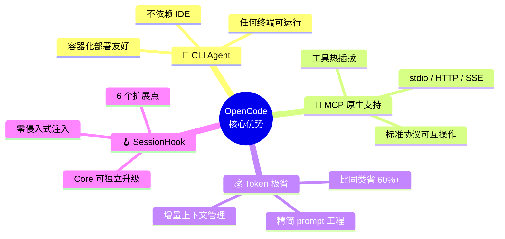

**Token 成本对比（同等任务）**：

| 场景 | 典型 AI 产品 | OpenCode Agent | 节省比例 |
|------|-------------|----------------|---------|
| 单轮问答 | ~800 tokens | ~300 tokens | **62%** |
| 多工具编排 | ~4000 tokens | ~1500 tokens | **63%** |
| 长对话 (10 轮) | ~12000 tokens | ~5000 tokens | **58%** |

OpenCode 的 Agent 架构在 prompt 层面做了大量优化：只传递必要的上下文，工具描述按需加载，历史消息智能裁剪。这意味着同等质量的 AI 输出，成本可以低到竞品的 1/3。

对企业来说，100 个人日常使用，月成本可能只有几百块，而不是几万块。

### MCP 生态治理

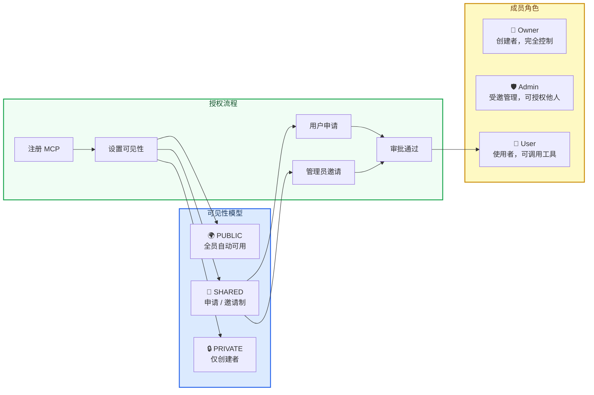

**设计要点**：
- MCP 授权与系统 RBAC **完全解耦**——不依赖角色、部门，只看 MCP 自身的成员列表
- PUBLIC 类型 MCP 自动对所有人可用，零配置
- SHARED 类型支持**双向**：用户主动申请 + 管理员主动邀请
- 每个 MCP 有独立的健康检查，异常时自动熔断保护

### 成本控制体系

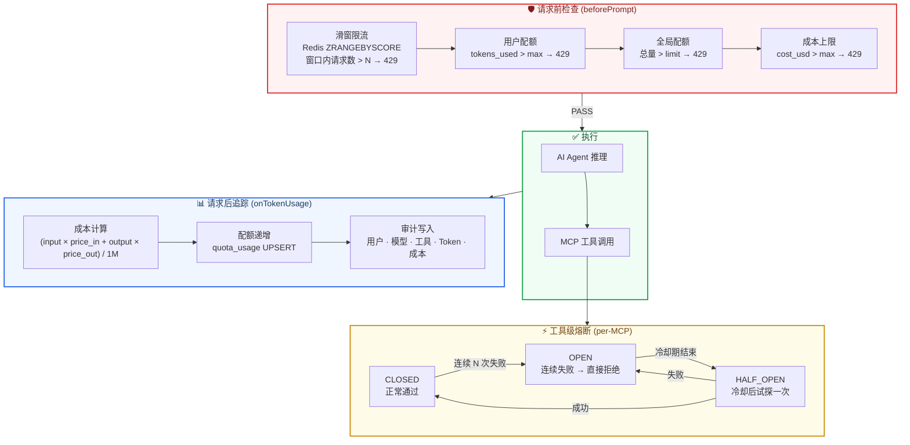

**成本可控的关键**：
- **Token 计量分离**：input / output / cached 分别统计，按模型定价精确计费
- **多级配额**：用户级 + 全局级，按日 / 按月周期自动轮转
- **熔断保护**：某个 MCP 故障时快速失败，避免 AI 反复重试浪费 Token
- **审计闭环**：每一分钱花在哪里，清清楚楚

### SessionHook 扩展机制

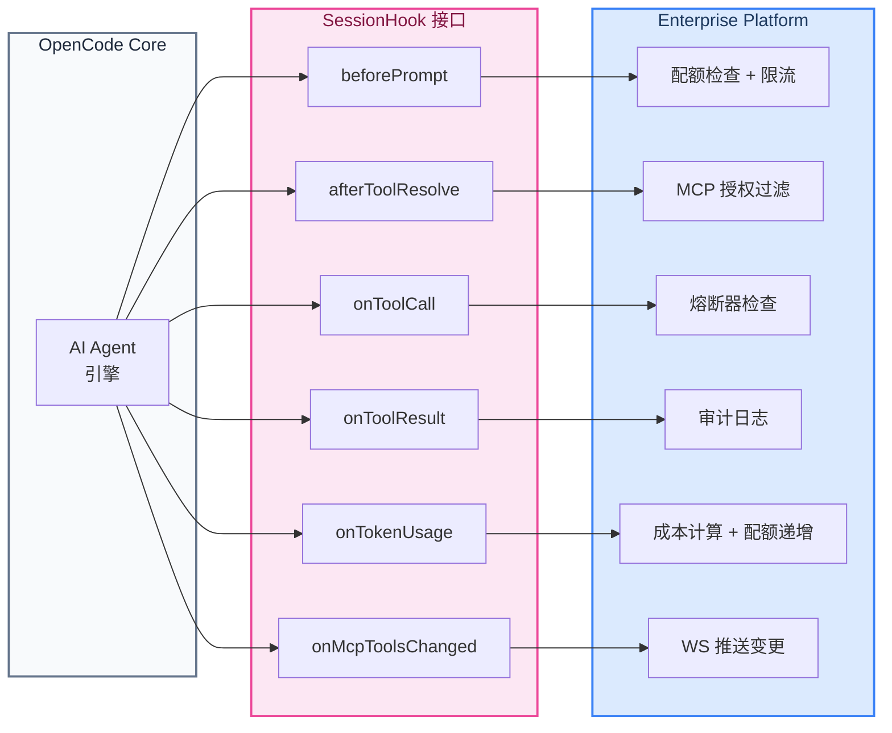

**核心优势**：OpenCode Core 可独立升级，企业层通过 Hook 注入，**不修改上游任何一行代码**。

### 实时通信架构

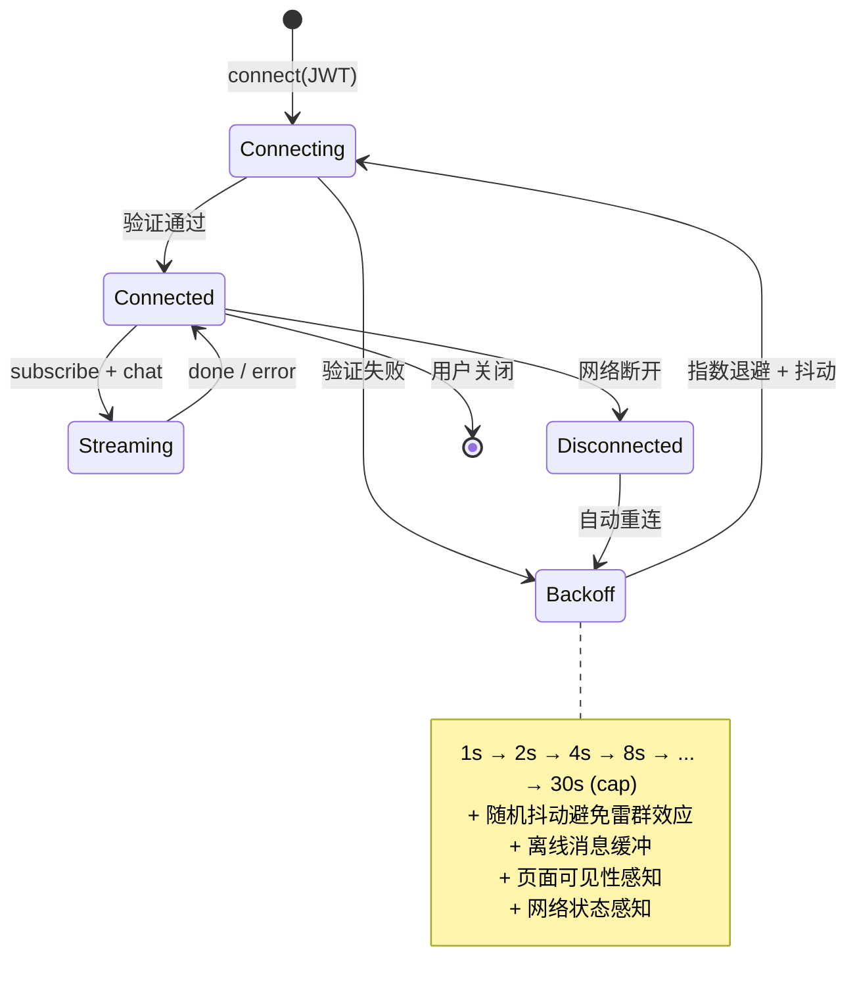

**生产级保障**：
- 心跳探活（30s ping，60s 无响应断开）
- 服务端 Sweeper 定期清理僵尸连接
- 每用户最多 10 个并发连接
- Safe Send 防止向已关闭 socket 写入

---

## 技术栈

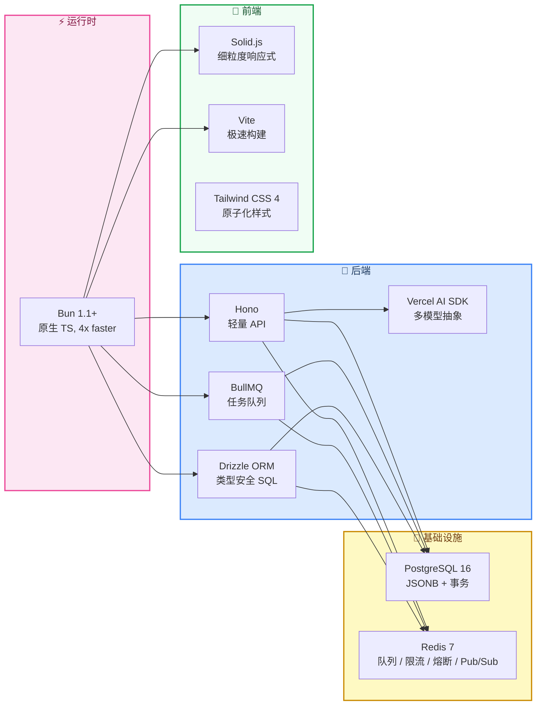

| 选型 | 理由 |
|------|------|
| **Bun** | 原生 TypeScript 运行时，启动快、内存省，适合 Worker 密集场景 |
| **Hono** | 零依赖 Web 框架，兼容 Web Standard API，路由性能极高 |
| **Solid.js** | 无虚拟 DOM，编译期优化，同等 UI 复杂度下 bundle 更小 |
| **Drizzle** | 类型安全的 SQL builder，不做过度抽象，保留 SQL 可控性 |
| **BullMQ** | Redis 驱动的任务队列，成熟稳定，支持优先级和并发限制 |
| **PostgreSQL** | JSONB 支持审计日志中工具调用链的复杂查询 |
| **Redis** | 一个实例承担队列 + 限流 + 熔断 + Pub/Sub，运维成本最低 |

---

## 快速开始

请参阅 **[部署指南](docs/deployment.md)**，包含：

- 前置环境要求（Bun / PostgreSQL / Redis）
- Docker 一键启动基础设施
- 环境变量完整说明（含飞书配置来源）
- 数据库初始化步骤
- 本地开发三终端启动
- Docker 镜像构建 & Compose 编排
- Kubernetes 生产部署 + HPA 自动扩容
- 故障排查手册

---

## 项目结构

```
opencode/
├── packages/
│   ├── opencode/                # OpenCode Core — AI Agent 引擎
│   │
│   ├── platform/                # 企业管控层
│   │   └── src/
│   │       ├── auth/            # 飞书 OAuth + JWT + 身份映射
│   │       ├── rbac/            # 角色权限
│   │       ├── billing/         # 配额 + 审计 + 仪表盘
│   │       ├── mcp-manager/     # MCP 注册表 + 成员 + 健康检查
│   │       ├── model/           # 多模型配置
│   │       ├── session/         # 会话 + 消息
│   │       ├── hooks/           # 6 个 SessionHook 实现
│   │       ├── server/          # Hono 路由 + WebSocket
│   │       ├── worker/          # BullMQ 消费者 + AI Agent
│   │       └── im/              # 飞书 IM 适配器
│   │
│   └── dashboard/               # Web 前端
│       └── src/
│           ├── pages/           # Chat / Dashboard / MCP / Models / Users / Quotas / Audit
│           ├── components/      # UI 组件库
│           ├── stores/          # 状态管理
│           └── lib/             # WebSocket / API / 工具函数
│
└── docs/
    ├── deployment.md            # 部署指南
    └── assets/                  # 截图素材
```

---

## API 概览

```
GET  /health                              健康检查

POST /api/auth/feishu/callback            飞书 OAuth 回调
POST /api/auth/refresh                    JWT 刷新
GET  /api/auth/me                         当前用户

GET  /api/sessions                        会话列表
POST /api/sessions                        创建会话
GET  /api/sessions/:id                    消息历史
DELETE /api/sessions/:id                  删除会话

GET  /api/mcp/market                      MCP 市场
POST /api/mcp                             注册 MCP
PUT  /api/mcp/:id                         更新 MCP
GET  /api/mcp/:id                         详情 + 成员
POST /api/mcp/:id/authorize               添加成员
DELETE /api/mcp/:id/authorize             移除成员

GET  /api/models                          可用模型
POST /api/models/admin                    新增模型
PUT  /api/models/admin/reorder            排序
PUT  /api/models/admin/:id                编辑
DELETE /api/models/admin/:id              删除

GET  /api/admin/users                     用户管理
PUT  /api/admin/users/:id/roles           修改角色

GET  /api/billing/quotas-with-usage       配额列表
POST /api/billing/quotas                  创建配额

GET  /api/dashboard/overview              KPI 概览
GET  /api/dashboard/trend                 Token 趋势
GET  /api/dashboard/active-users          活跃用户排行
GET  /api/dashboard/mcp-leaderboard       MCP 使用排行
GET  /api/dashboard/model-distribution    模型分布
GET  /api/dashboard/top-tools             热门工具

WS   /ws?token=JWT                        实时通信
```

完整的 WebSocket 协议、Hook 系统、API 字段说明详见 **[部署指南](docs/deployment.md)**。

---

## 与 OpenCode 的关系

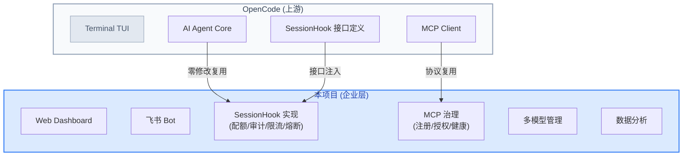

- 本项目**不修改** OpenCode Core 的任何代码
- 通过 SessionHook 接口零侵入注入企业特性
- 上游更新时，只需升级 `packages/opencode`

---

## License

MIT
